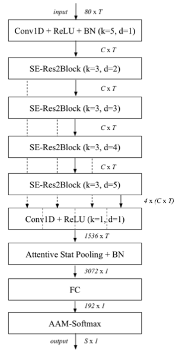

# ECAPA CNN-TDNN

This project is a reimplementation of [ECAPA CNN-TDNN](https://arxiv.org/pdf/2104.02370.pdf)-based speaker verification.

It was created based on [SpeechBrain](https://github.com/speechbrain/speechbrain), an open-source AI speech toolkit built on PyTorch.

## Introduction

Speaker verification is the task of comparing the voice characteristics of a speaker against a claimed identity to either accept or reject the claim.

The speaker's identity can be verified by comparing the speaker embeddings of the enrollment and test recordings.

ECAPA CNN-TDNN, which is one of the most powerful speaker embedding extractors to the present, is an enhanced version of [ECAPA-TDNN](https://arxiv.org/pdf/2005.07143.pdf).

It is formed by adding *a 2D convolution-based network stem (see the following left figure)* to the *ECAPA-TDNN architecture (see the following right figure)*.

<p align="center">
  
  
</p>
  
According to the authors, it enables building local frequency invariant features before applying 1D convolutions, which explicitly combine the frequency positional information of the features.

## Performance

The VoxCeleb2 dataset (5,994 speakers) was used for training. (Data augmentation was skipped due to limited computational resources. I plan to update the results with data augmentation in the future.) The number of the training epochs were set to 5.

When the VoxCeleb1-O dataset (40 speakers) was used for testing, the following speaker verification results were obtained:
|  Architecture           |    EER (%)  | minDCF |
|:-----------------------:|:-----------:|:------:|
|   ECAPA-TDNN (C=2048)   |     1.57    |  0.15  |
| ECAPA CNN-TDNN (C=2048) |             |        |

## Requirements

This project follows the requirements of [SpeechBrain](https://github.com/speechbrain/speechbrain).

For your information, I used the Docker image called [gastron/speechbrain-ci](https://hub.docker.com/r/gastron/speechbrain-ci).
```
docker pull gastron/speechbrain-ci
```

## Usage

### Data preparation

1. Download the VoxCelb dataset from https://mm.kaist.ac.kr/datasets/voxceleb/.
2. Place all .wav files in a folder named 'wav'.
3. Create another folder and name it 'my_folder' (or any desired name).
4. Move the 'wav' folder into the 'my_folder'.

### Training

Run:
```
python train_speaker_embeddings.py hparams/train_ecapa_cnn_tdnn.yaml --data_folder="my_folder"
```

### Testing

Specify the location of the checkpoint file for the embedding model in the following line of the 'speaker_verification_cosine.py' file:
```
pretrain = Pretrainer(collect_in='model_local', loadables={'model': params["embedding_model"]}, paths={'model': '(directory)/embdding_moel.ckpt'})
```

Run:
```
python speaker_verification_cosine.py hparams/verification_ecapa_cnn_tdnn.yaml --data_folder="my_folder"
```


## Acknolwedgement

This code heavily relies on [the SpeechBrain's recipe of VoxCeleb](https://github.com/speechbrain/speechbrain/tree/develop/recipes/VoxCeleb).

I would like to acknowledge their contributions and the use of their code as a foundation for this project.
